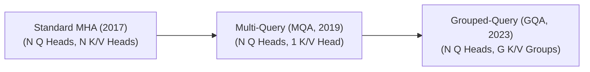

# Awesome-Multihead-Attention
## Multi-Head Attention (MHA): Evolution, Variants, & Applications

Multi-Head Attention is the computational engine of the Transformer architecture. Instead of performing a single attention function over the full vector dimension, Multi-Head Attention linearly projects Queries ($Q$), Keys ($K$), and Values ($V$) into multiple lower-dimensional subspaces. Each "head" processes these subspaces in parallel, allowing the model to simultaneously attend to information from different representation spaces at different positions.

---

## 1. The Chronological Evolution

The architectural progression of multi-head structures has been driven entirely by the need to optimize memory footprints, lower computational complexity, and extend context windows.

| Variant | Details | First Used | Paper Link |
| :--- | :--- | :--- | :--- |
| **Standard Multi-Head Attention (Vaswani et al., 2017)** | *Concept:* The foundation. Allocates an independent set of Key ($K$) and Value ($V$) projection matrices for every single Query ($Q$) head.  *Limitation:* Creates a massive Key-Value (KV) cache memory bottleneck during inference serving, limiting maximum batch sizes. | 2017 | [https://arxiv.org/abs/1706.03762](https://arxiv.org/abs/1706.03762) |
| **Multi-Query Attention (MQA, Shazeer, 2019)** | *Concept:* Extreme memory compression. Collapses the Key and Value matrices into a single, shared head, while keeping multiple distinct Query heads.  *Limitation:* Significantly reduces VRAM overhead, but can cause minor drops in model capacity and accuracy on complex tasks. | 2019 | [https://arxiv.org/abs/1911.02150](https://arxiv.org/abs/1911.02150) |
| **Grouped-Query Attention (GQA, Ainslie et al., 2023)** | *Concept:* The modern industry standard (e.g., Llama 3). Acts as an adjustable compromise by grouping Query heads into clusters, where each cluster shares a single Key and Value head.  *Significance:* Delivers nearly the same processing speed as MQA while retaining the high model capacity and accuracy of standard MHA. | 2023 | [https://arxiv.org/abs/2305.13245](https://arxiv.org/abs/2305.13245) |

---

## 2. Structural & Spatial Masking Variants

These variants modify the attention matrix visibility rules to adapt the multi-head block to different learning objectives and structural layouts.

| Variant | Details | First Used | Paper Link |
| :--- | :--- | :--- | :--- |
| **Bidirectional Attention (Encoder)** | *Mechanism:* Allows every token to look at and attend to all other tokens in the entire sequence length.  *Application:* Used in comprehension-heavy models like BERT to gather full contextual awareness. | 2018 | [https://arxiv.org/abs/1810.04805](https://arxiv.org/abs/1810.04805) |
| **Causal Attention (Decoder)** | *Mechanism:* Uses a lower-triangular mask to force attention heads to ignore future tokens, allowing tokens to only attend to historical indices ($\le i$).  *Application:* The engine behind autoregressive generative models like GPT and Claude. | 2017 | [https://arxiv.org/abs/1706.03762](https://arxiv.org/abs/1706.03762) |
| **Prefix / Masked Hybrid Attention** | *Mechanism:* Combines both styles within a single block. It allows bidirectional attention over an initial system prompt or context string, but switches to causal execution for generation tokens. | 2019 | [https://arxiv.org/abs/1905.03197](https://arxiv.org/abs/1905.03197) |

---

## 3. Mathematical & Scale Optimization Types

These variations alter the traditional $O(N^2)$ attention calculation matrix to enable processing for ultra-long context limits.

| Variant | Details | First Used | Paper Link |
| :--- | :--- | :--- | :--- |
| **FlashAttention Kernels** | *Type:* Hardware-Aware Optimization.  *Mechanism:* Fuses the multi-head computation steps into fast, on-chip GPU SRAM using tiling methods, dropping the memory footprint from quadratic down to linear ($O(N)$). | 2022 | [https://arxiv.org/abs/2205.14135](https://arxiv.org/abs/2205.14135) |
| **Linear Attention (Performer / Linear Transformer)** | *Type:* Kernel Trick Approximation.  *Mechanism:* Approximates the standard Softmax function using kernel maps, altering the calculation order from $(Q \times K^T) \times V$ to $Q \times (K^T \times V)$.  *Pros:* Drops time and space complexity to true linear scaling ($O(N)$) relative to token length. | 2020 | [https://arxiv.org/abs/2006.16236](https://arxiv.org/abs/2006.16236) |
| **Multi-Head Latent Attention (MLA)** | *Type:* Low-Rank Compression (DeepSeek-V3).  *Mechanism:* Compresses the Key-Value cache down into a tiny, low-rank latent vector before attention calculations, up-projecting them dynamically in SRAM during execution.  *Pros:* Drastically compresses the KV cache memory footprint beyond the limits of standard GQA. | 2024 | [https://arxiv.org/abs/2405.04434](https://arxiv.org/abs/2405.04434) |

---

## 4. Cross-Domain Applications

| Application | Details | First Used | Paper Link |
| :--- | :--- | :--- | :--- |
| **Autoregressive Text Generation Foundations** | *Application:* Serves as the core sequence alignment mechanism for modern LLMs, allowing models to maintain long-range tracking across multi-turn user conversations. | 2017 | [https://arxiv.org/abs/1706.03762](https://arxiv.org/abs/1706.03762) |
| **Cross-Modal Vision-Language Alignment** | *Application:* Drives multi-modal systems by configuring one modality (e.g., Text) to provide the Queries, while a separate visual modality (e.g., Image tokens) serves as the Keys and Values, binding phrases to explicit pixels. | 2022 | [https://arxiv.org/abs/2204.14198](https://arxiv.org/abs/2204.14198) |
| **Spatio-Temporal Video Synthesis** | *Application:* Deployed in video generators (like Sora) via factored axial attention, where distinct attention head groups alternate between checking spatial image structures and tracking temporal motion shifts across video frames. | 2021 | [https://arxiv.org/abs/2102.05095](https://arxiv.org/abs/2102.05095) |
